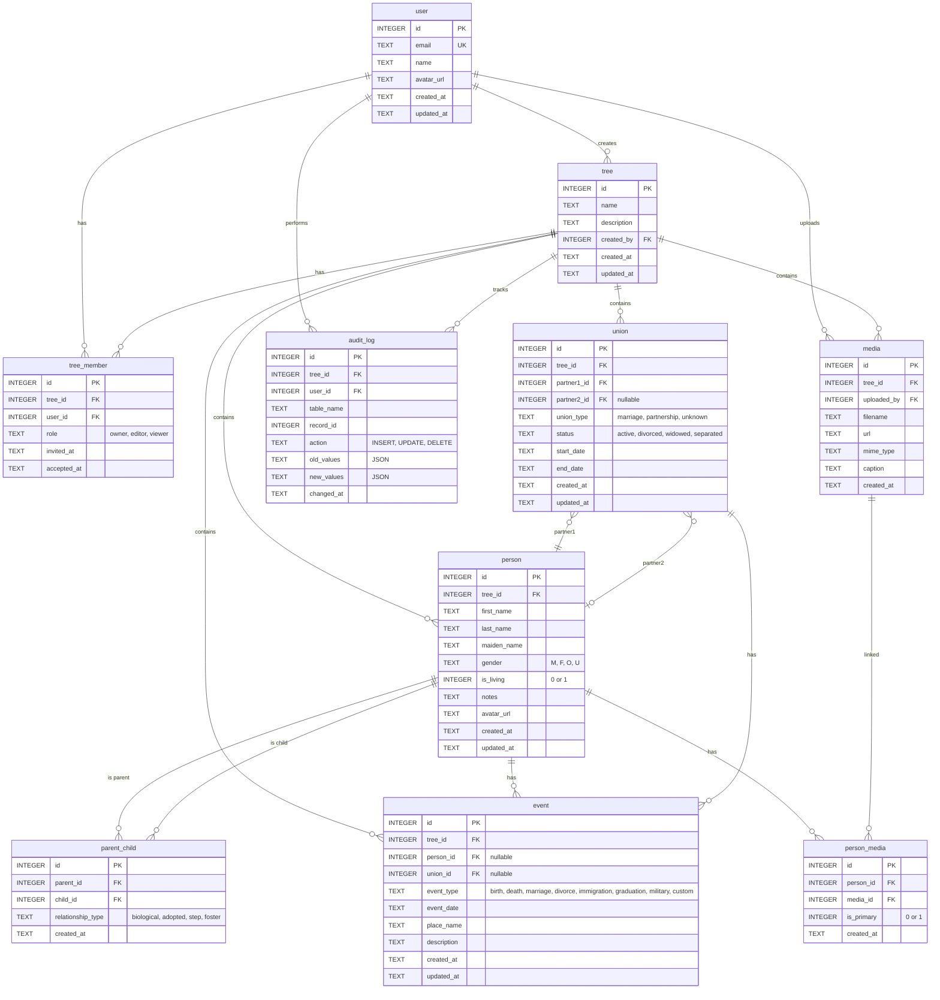

# Family Tree Database Schema

## Entity Relationship Diagram

## Tables Summary

| Table          | Purpose                                            |
| -------------- | -------------------------------------------------- |
| `user`         | User account                                       |
| `tree`         | Family tree container                              |
| `tree_member`  | User access to tree (roles: owner, editor, viewer) |
| `person`       | Individual in tree                                 |
| `union`        | Partnership between 1-2 people                     |
| `parent_child` | Parent to child link                               |
| `event`        | Life events (birth, death, marriage, etc.)         |
| `media`        | Photos, documents                                  |
| `person_media` | Person to media join table                         |
| `audit_log`    | Change history for all tables                      |

## Design Decisions

1. **Multi-tree support** - Each tree is isolated, users can belong to multiple trees
2. **Role-based access** - owner, editor, viewer roles per tree
3. **Flexible relationships** - parent_child supports biological, adopted, step, foster
4. **Union model** - Handles marriages, partnerships, divorces, remarriages cleanly
5. **Event-based history** - Extensible event types instead of fixed columns
6. **Hard deletes with audit log** - No soft deletes, full history in audit_log
7. **SQLite/D1 compatible** - Uses only TEXT, INTEGER, REAL, BLOB, NULL types
